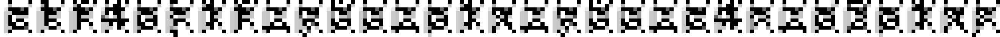

# depixelization

## 問題文
Can you depixelize it ?  
[depixelization.tar.gz](files/depixelization.tar.gz) be6484841b5f6086c9f2609fdce5622313308688  

## 難易度
**Medium**  

## 作問にあたって
モザイク加工したテキストを復元するツール([Depix](https://github.com/beurtschipper/Depix))を見て思い付いたものです。  
ツール自体はフォントのサイズや種類によって使えなかったのですが、オレオレモザイクなら比較的簡単に復元できると考え出題しました。  
作業量の割には面白みに欠けるとも思いましたが、このテーマを使った問題を作りたかったので許して欲しいです。  
文字P、I、Xを入れたのはそのままモザイク加工すると普通に読めて焦ったからです(汗)。  

## 解法
output.pngとpixelization.pyが配られる。  
output.pngは以下のようなモザイク画像であり、pixelization.pyはモザイク加工用のスクリプトのようだ。  
  
pixelization.pyでは、フラグの文字と文字P、I、Xを重ねて縮小することでモザイク加工を行っている。  
文字P、I、Xを除去することを考えるが、情報量が落ちているため難しそうだ。  
復元ができなくともモザイク加工が可能なので、アルファベットをモザイク画像にした先で一致を見てやればよいことに気づく。  
さらにモザイク加工のためのフォントやサイズなどはソースコードより既知である。  
OpenCVのバージョンによっては完全一致しない場合があるが、一致率の最も高いアルファベットを選び出せばよい。  
```bash
$ python solver.py
ctf4b{1f_y0u_p1x_y0u_c4n_d3p1x}
```

## ctf4b{1f_y0u_p1x_y0u_c4n_d3p1x}
