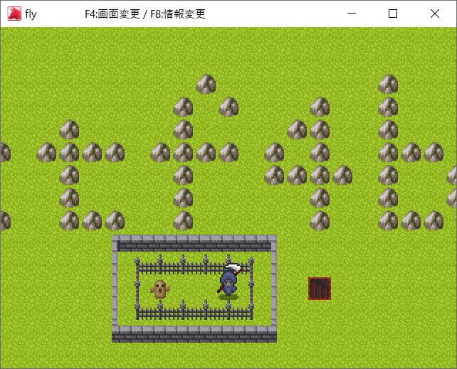
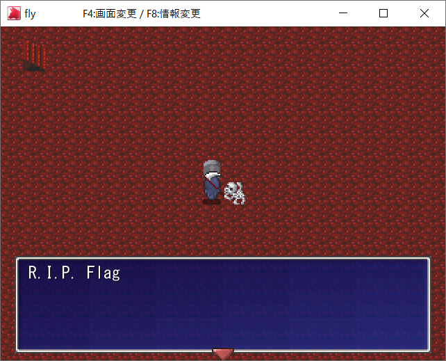
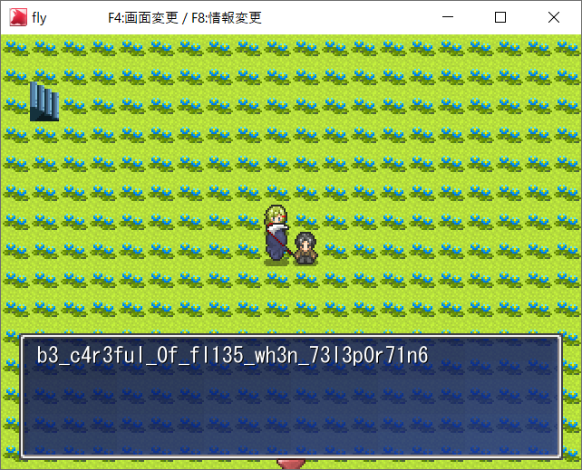

# fly

## 問題文
Can you fly ?  
Are you fly ?  
[fly.tar.gz](files/fly.tar.gz) 5d6de04bf5450300e66b546a326640bf45c78b38  

## 難易度
**Medium**  

## 作問にあたって
メモリをいじくるGUIゲームのチート問です。  
マップ隠蔽部分を無くしてbeginnerにしようかと考えましたが、あまりに簡単すぎるため止めました。  
余談ですが作問者の一人Yさんに力技で解かれて泣きました。  
フラグが別マップにあることを教えるべきだとの意見が出ましたが、駄々をこねて初期のまま出させてもらいました。  

## 解法
ゲームが配布されている。
ゲームデータが暗号化されているので、stringsなどでフラグは出てこない。  
リアルでチートは規約違反である場合が多いが、CheatEngineなどがツールとしてよく知られている。  
主人公がハニワに閉じ込められている。  
  
まずはメモリを書き換えることによる主人公の座標の移動を試みる。  
左右に動くことができるので以下の手順でX座標を特定する。  
- 初期値不明で検索  
- 以下を繰り返す  
  - 左に動き、値減少で検索(X座標を右が正だと予想)  
  - 右に動き、値増加で検索  
  - 5以上で値検索(X座標が一マスごとに1増えると予想、5マスより右にいるので)  
  - 100以下で値検索  

これらにより特定したX座標を書き換え、閉鎖空間から外に出ることに成功する。  
赤色の階段から別のマップに移動できるが、フラグはない。  
  
青色の階段があることから、移動できないマップがあると考えマップをメモリ上から探す。  
メモリダンプ(Windowsの機能で可能)してstringsにかけるとctf4b.mpsやflag1.mpsやflag2.mpsが見える(flagやゲーム名であるctf4bでメモリを検索してもよい)。  
どれかが移動できないマップであるので、すべて試せばよい。  
メモリ内のflag1.mpsをすべてflag2.mpsに書き換えると無事フラグがあるマップへ飛べる。  
  
ctf4b{}の中を教えてもらえる。  
別解として、ファイル暗号を解除しマップなどデータを抽出するという方法もある。  

## ctf4b{b3_c4r3ful_0f_fl135_wh3n_73l3p0r71n6}