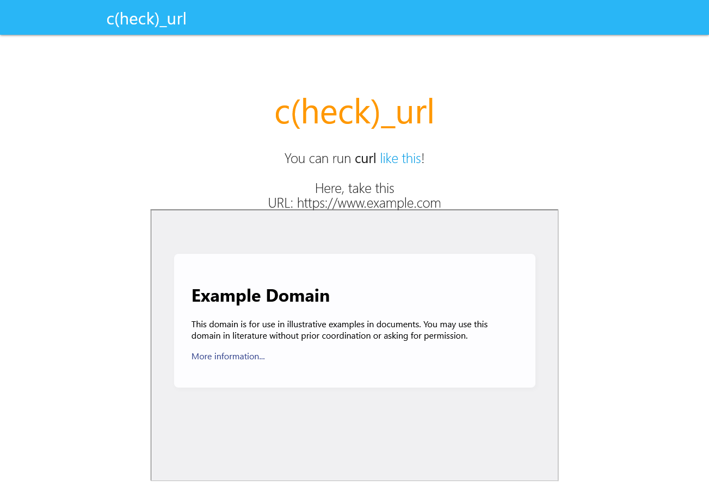

# check_url

## 問題文
Have you ever used curl ?  
[https://check-url.quals.beginners.seccon.jp/](https://check-url.quals.beginners.seccon.jp/)  
[index.php](files/index.php) 8524943bf9415bf35516300bf6e16030e0cdd583  

## 難易度
**Easy**  

## 作問にあたって
某企業の脆弱性として本当にあったヤツです。  
localhostを弾いていたが、改造文字列では普通にSSRFが通ってしまっていた。  
curlは`$ curl "ｗｗｗ。ｇｏｏｇｌｅ。ｃｏｍ"`もOKなので全角でのバイパスにしようか迷ったが、現実には少なそうなので止めました。  

## 解法
ソースコードが配られる。  
`$_SERVER["REMOTE_ADDR"] === "127.0.0.1"`にてローカルからのアクセスではAdminだと判断されるが、Trueにはならない。  
curlを実行できるようなのでSSRFでフラグを読みだせばよいとすぐにわかる。  
しかし、スーパーサニタイズによってアルファベットと数字以外弾かれる。  
```php
if ($url !== "https://www.example.com"){
  $url = preg_replace("/[^a-zA-Z0-9\/:]+/u", "👻", $url); //Super sanitizing
}
if(stripos($url,"localhost") !== false || stripos($url,"apache") !== false){
  die("do not hack me!");
}
```
`127.0.0.1`にはドットが含まれている。  
`localhost`ならばアルファベットのみだがこれも許可されていない。  
`localhost`の別の記述方法を探すと`2130706433`や`0x7F000001`や`017700000001`と表せる([参考](https://qiita.com/naka_kyon/items/88478be20b300e757fc0))。  
curl_execでは使用できないパターンもあるが、無事`https://check-url.quals.beginners.seccon.jp/?url=http://0x7F000001`でフラグが得られる。  
  

## ctf4b{5555rf_15_53rv3r_51d3_5up3r_54n171z3d_r3qu357_f0r63ry}